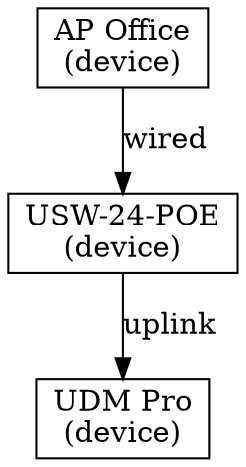

# UniFi MCP Server API Documentation

This document provides comprehensive documentation for the Model Context Protocol (MCP) server that exposes UniFi Network Controller functionality. The server enables AI agents and other applications to interact with UniFi network infrastructure in a standardized way.

## Table of Contents

- [Overview](#overview)
- [Configuration](#configuration)
- [Authentication](#authentication)
- [Performance Tracking](#performance-tracking)
- [MCP Tools](#mcp-tools)
- [MCP Resources](#mcp-resources)
- [Error Handling](#error-handling)
- [Rate Limiting](#rate-limiting)
- [Examples](#examples)

## Overview

The UniFi MCP Server bridges the gap between AI applications and UniFi Network Controllers by exposing network management capabilities as MCP tools and resources. It handles authentication, request formatting, and error handling, providing a clean interface for network automation.

### Architecture

```
┌─────────────────┐
│  AI Application │
│  (ChatGPT, Cursor, etc.) │
└────────┬────────┘
         │ MCP Protocol
         │
┌────────▼────────┐
│   UniFi MCP     │
│     Server      │
└────────┬────────┘
         │ UniFi API
         │
┌────────▼────────┐
│  UniFi Network  │
│   Controller    │
└─────────────────┘
```

### Key Features

- **Device Management:** List, configure, and monitor UniFi devices
- **Network Configuration:** Manage networks, VLANs, and subnets
- **Client Information:** Query connected clients and their status
- **Firewall Rules:** Create and manage firewall rules
- **Site Management:** Work with multiple UniFi sites
- **Real-time Monitoring:** Access device and network statistics

## Configuration

### Environment Variables

Configure the MCP server using environment variables:

| Variable | Description | Required | Default |
|----------|-------------|----------|---------|
| `UNIFI_API_KEY` | UniFi API Key from unifi.ui.com | Yes | - |
| `UNIFI_API_TYPE` | API type: `cloud-v1`, `cloud-ea`, or `local` | No | `cloud-ea` |
| `UNIFI_CLOUD_API_URL` | Cloud API base URL | No | `https://api.ui.com` |
| `UNIFI_LOCAL_HOST` | Local gateway hostname/IP (required for `local`) | No | - |
| `UNIFI_LOCAL_PORT` | Local gateway port | No | `443` |
| `UNIFI_LOCAL_VERIFY_SSL` | Verify SSL certificates for local mode | No | `true` |
| `UNIFI_DEFAULT_SITE` | Default site ID | No | `default` |
| `UNIFI_SITE_MANAGER_ENABLED` | Enable Site Manager API | No | `false` |
| `UNIFI_RATE_LIMIT_REQUESTS` | Max requests per window | No | `100` |
| `UNIFI_RATE_LIMIT_PERIOD` | Rate limit window (seconds) | No | `60` |
| `UNIFI_REQUEST_TIMEOUT` | Request timeout (seconds) | No | `30` |
| `UNIFI_MAX_RETRIES` | Maximum retry attempts | No | `3` |
| `UNIFI_RETRY_BACKOFF_FACTOR` | Exponential backoff factor | No | `2.0` |
| `UNIFI_CACHE_ENABLED` | Enable response caching | No | `true` |
| `UNIFI_CACHE_TTL` | Cache TTL (seconds) | No | `300` |
| `MCP_TRANSPORT` | MCP transport mode: `stdio` or `http` | No | `stdio` |
| `MCP_HOST` | MCP HTTP bind host | No | `0.0.0.0` |
| `MCP_PORT` | MCP HTTP bind port | No | `8080` |
| `MCP_PATH` | MCP HTTP endpoint path | No | `/mcp` |
| `MCP_PROFILE` | Tool exposure profile: `deep-research` or `full` | No | `full` |
| `LOG_LEVEL` | Application log level | No | `INFO` |
| `LOG_API_REQUESTS` | Log API requests | No | `true` |
| `UNIFI_AUDIT_LOG_ENABLED` | Enable audit logging | No | `true` |

### Configuration File

Alternatively, use a `config.yaml` file:

```yaml
unifi:
  api_key: your-api-key-here
  api_type: cloud-v1  # or cloud-ea/local
  cloud_api_url: https://api.ui.com
  local_host: 192.168.1.1  # required for local
  local_port: 443
  local_verify_ssl: true
  default_site: default
  site_manager_enabled: false
  rate_limit_requests: 100
  rate_limit_period: 60
  request_timeout: 30
  max_retries: 3
  retry_backoff_factor: 2.0
  cache_enabled: true
  cache_ttl: 300

mcp:
  transport: stdio
  host: 0.0.0.0
  port: 8080
  path: /mcp
  profile: full
```

**Legacy env compatibility:** `UNIFI_HOST/PORT/VERIFY_SSL/SITE` and `UNIFI_RATE_LIMIT/UNIFI_TIMEOUT` are still accepted but deprecated; prefer the names listed above. Deprecations will be removed in a future major release.

**Note:** Environment variables take precedence over configuration file settings.

## Performance Tracking

### Agnost.ai Integration (Optional)

The UniFi MCP Server includes optional performance tracking powered by [agnost.ai](https://agnost.ai) to monitor server performance, usage patterns, and identify optimization opportunities.

#### Features

- **Real-time Performance Metrics**: Track tool execution times, success rates, and error patterns
- **User Analytics**: Monitor which tools are most frequently used and by whom
- **Resource Access Patterns**: Understand how MCP resources are accessed
- **Error Tracking**: Automatic error capture with stack traces and context
- **Custom Event Tracking**: Track specific business events (device adoptions, configuration changes)
- **Dashboard**: Visual analytics dashboard for performance insights

#### Configuration

Performance tracking is disabled by default and can be enabled via environment variables:

```env
# Enable performance tracking
AGNOST_ENABLED=true

# Agnost Organization ID (obtain from https://app.agnost.ai)
AGNOST_ORG_ID=your-organization-id-here

# Optional: Custom endpoint (defaults to https://api.agnost.ai)
AGNOST_ENDPOINT=https://api.agnost.ai

# Optional: Control what data is tracked
AGNOST_DISABLE_INPUT=false   # Set to true to disable input parameter tracking
AGNOST_DISABLE_OUTPUT=false  # Set to true to disable output/result tracking
```

#### Tracking Controls

The agnost integration provides granular control over what data is tracked:

**Input Tracking (`disable_input`):**

- When `false` (default): Tool input parameters are tracked
- When `true`: Input parameters are excluded from tracking
- Use this to prevent sensitive configuration data from being sent

**Output Tracking (`disable_output`):**

- When `false` (default): Tool results and outputs are tracked
- When `true`: Output data is excluded from tracking
- Use this to prevent sensitive response data from being sent

**Example - Privacy-Focused Configuration:**

```env
AGNOST_ENABLED=true
AGNOST_ORG_ID=your-org-id
AGNOST_DISABLE_INPUT=true   # Don't track input parameters
AGNOST_DISABLE_OUTPUT=true  # Don't track output data
# This configuration tracks only tool names, execution times, and success/failure
```

#### Tracked Metrics

The following metrics are automatically tracked by agnost.ai:

**Tool Invocation Metrics:**

- Tool name
- Input parameters (if `disable_input=false`)
- Output results (if `disable_output=false`)
- Execution time (milliseconds)
- Success/failure status
- Error messages (if any)

**Resource Access Metrics:**

- Resource URI accessed
- Response data (if `disable_output=false`)
- Response size
- Access patterns

**Error Metrics:**

- Error type and message
- Stack trace and context
- Request metadata
- Frequency and patterns

**Performance Metrics:**

- Average execution time per tool
- Tool usage frequency
- Peak usage times
- Success/failure rates

#### Privacy & Security

**Data Protection:**

- Granular control via `disable_input` and `disable_output` flags
- Sensitive data (API keys, passwords) automatically masked in logs
- All data encrypted in transit (HTTPS)
- Opt-in only (disabled by default)

**Privacy Controls:**

- Disable input tracking to prevent parameter exposure
- Disable output tracking to prevent response data exposure
- Complete opt-out by setting `AGNOST_ENABLED=false`
- No personally identifiable information (PII) collected by default

**Compliance:**

- GDPR compliant data handling
- Configurable data retention policies via agnost.ai dashboard
- Transparent data collection (documented in this API guide)
- Data encrypted in transit and at rest

#### Example Configurations

**Full Tracking (Docker):**

```bash
docker run -i \
  --name unifi-mcp \
  -e UNIFI_API_KEY=your-unifi-api-key \
  -e UNIFI_API_TYPE=cloud \
  -e AGNOST_ENABLED=true \
  -e AGNOST_ORG_ID=your-organization-id \
  ghcr.io/enuno/unifi-mcp-server:latest
```

**Privacy-Focused Tracking (MCP Client):**

```json
{
  "mcpServers": {
    "unifi": {
      "command": "uv",
      "args": ["--directory", "/path/to/unifi-mcp-server", "run", "mcp", "run", "src/main.py"],
      "env": {
        "UNIFI_API_KEY": "your-api-key-here",
        "UNIFI_API_TYPE": "cloud",
        "AGNOST_ENABLED": "true",
        "AGNOST_ORG_ID": "your-org-id",
        "AGNOST_DISABLE_INPUT": "true",
        "AGNOST_DISABLE_OUTPUT": "true"
      }
    }
  }
}
```

**Metadata-Only Tracking:**

```env
AGNOST_ENABLED=true
AGNOST_ORG_ID=your-org-id
AGNOST_DISABLE_INPUT=true
AGNOST_DISABLE_OUTPUT=true
# Tracks only: tool names, execution times, success/failure rates
```

#### Viewing Analytics

Once configured, visit your agnost.ai dashboard at <https://app.agnost.ai> to view:

- **Real-time Performance Metrics**: Tool execution times and latency
- **Usage Trends**: Most frequently used tools and resources
- **Error Rates**: Failure patterns and error types
- **Performance Bottlenecks**: Slowest operations and optimization opportunities
- **Historical Data**: Trends over time for capacity planning

For more information, see the [agnost.ai FastMCP documentation](https://docs.agnost.ai/fastmcp).

### MCP Toolbox Dashboard

For a web-based analytics dashboard with visual metrics and debugging tools, use MCP Toolbox:

```bash
# Start with Docker Compose
docker-compose up -d

# Access dashboard
open http://localhost:8080
```

MCP Toolbox provides:

- Real-time performance monitoring
- Visual analytics and graphs
- Error tracking and debugging
- Historical trend analysis
- Request/response inspection

See [MCP_TOOLBOX.md](MCP_TOOLBOX.md) for complete documentation.

---

## Authentication

### Obtaining Your API Key

The UniFi MCP Server uses the official UniFi Cloud API with API key authentication:

1. **Login** to [UniFi Site Manager](https://unifi.ui.com)
2. **Navigate** to Settings → Control Plane → Integrations
3. **Create** a new API Key by clicking "Create API Key"
4. **Save** the key immediately - it's only displayed once!
5. **Store** the key securely in environment variables or secret management

### Authentication Method

The server uses **stateless API key authentication** via the `X-API-Key` HTTP header:

```http
GET /v1/sites HTTP/1.1
Host: api.ui.com
X-API-Key: your-api-key-here
Accept: application/json
```

No session management or cookie handling is required. Each request is independently authenticated.

### API Access Modes

**Cloud API (Recommended)**

- Base URL: `https://api.ui.com/v1/`
- Access cloud-hosted UniFi instances
- Requires internet connectivity
- SSL verification recommended

**Local Gateway Proxy**

- Base URL: `https://{gateway-ip}:{port}/proxy/network/integration`
- Access local UniFi gateway directly
- Works without internet
- May require SSL verification disabled for self-signed certificates

### Current Limitations

- **Read-Only Access**: The Early Access API is currently read-only. Write operations will be available in future API versions and will require manual key updates.
- **Rate Limiting**: See [Rate Limiting](#rate-limiting) section below

### Security Considerations

- **Never hardcode API keys** in your code
- Store API keys in environment variables or secure secret management systems (AWS Secrets Manager, HashiCorp Vault, etc.)
- Use HTTPS when connecting to the UniFi API (especially for cloud)
- Implement proper access controls for MCP server access
- **Rotate keys regularly** - API keys can be regenerated from unifi.ui.com
- Monitor API key usage for suspicious activity
- Treat API keys like passwords - they provide full access to your UniFi environment

## MCP Tools

Tools are executable functions that perform actions on the UniFi Controller.

### Tool Categories

- **Phase 3 Tools:** Read-only operations for querying network information
- **Phase 4 Tools:** Mutating operations with safety mechanisms (confirm + dry-run)

### Health Check

#### `health_check`

Verify the MCP server is running and accessible.

**Parameters:** None

**Returns:**
Server health status information.

**Example:**

```python
result = await mcp.call_tool("health_check", {})
```

**Response:**

```json
{
  "status": "healthy",
  "version": "0.1.0",
  "api_type": "cloud"
}
```

### Device Management Tools

#### `get_device_details`

Get detailed information for a specific device.

**Parameters:**

- `site_id` (string, required): Site identifier
- `device_id` (string, required): Device ID

**Returns:**
Object containing detailed device information.

**Example:**

```python
result = await mcp.call_tool("get_device_details", {
    "site_id": "default",
    "device_id": "507f1f77bcf86cd799439011"
})
```

**Response:**

```json
{
  "id": "507f1f77bcf86cd799439011",
  "name": "Living Room AP",
  "model": "U6-LR",
  "type": "uap",
  "mac": "aa:bb:cc:dd:ee:ff",
  "ip": "192.168.1.100",
  "state": 1,
  "uptime": 86400,
  "version": "6.5.55.14277"
}
```

#### `get_device_statistics`

Retrieve real-time statistics for a device.

**Parameters:**

- `site_id` (string, required): Site identifier
- `device_id` (string, required): Device ID

**Returns:**
Object containing device statistics.

**Example:**

```python
result = await mcp.call_tool("get_device_statistics", {
    "site_id": "default",
    "device_id": "507f1f77bcf86cd799439011"
})
```

**Response:**

```json
{
  "device_id": "507f1f77bcf86cd799439011",
  "uptime": 86400,
  "cpu": 15,
  "mem": 42,
  "tx_bytes": 1024000000,
  "rx_bytes": 2048000000,
  "bytes": 3072000000,
  "state": 1,
  "uplink_depth": 0
}
```

#### `list_devices_by_type`

Filter devices by type (AP, switch, gateway).

**Parameters:**

- `site_id` (string, required): Site identifier
- `device_type` (string, required): Device type filter (uap, usw, ugw, udm, uxg, etc.)

**Returns:**
Array of device objects matching the type.

**Example:**

```python
result = await mcp.call_tool("list_devices_by_type", {
    "site_id": "default",
    "device_type": "uap"
})
```

#### `search_devices`

Search devices by name, MAC, or IP address.

**Parameters:**

- `site_id` (string, required): Site identifier
- `query` (string, required): Search query string

**Returns:**
Array of matching device objects.

**Example:**

```python
result = await mcp.call_tool("search_devices", {
    "site_id": "default",
    "query": "office"
})
```

### Client Management Tools

#### `get_client_details`

Get detailed information for a specific client.

**Parameters:**

- `site_id` (string, required): Site identifier
- `client_mac` (string, required): Client MAC address

**Returns:**
Object containing detailed client information.

**Example:**

```python
result = await mcp.call_tool("get_client_details", {
    "site_id": "default",
    "client_mac": "aa:bb:cc:dd:ee:01"
})
```

**Response:**

```json
{
  "mac": "aa:bb:cc:dd:ee:01",
  "hostname": "laptop-001",
  "ip": "192.168.1.100",
  "is_wired": false,
  "signal": -45,
  "tx_bytes": 1024000,
  "rx_bytes": 2048000
}
```

#### `get_client_statistics`

Retrieve bandwidth and connection statistics for a client.

**Parameters:**

- `site_id` (string, required): Site identifier
- `client_mac` (string, required): Client MAC address

**Returns:**
Object containing client statistics.

**Example:**

```python
result = await mcp.call_tool("get_client_statistics", {
    "site_id": "default",
    "client_mac": "aa:bb:cc:dd:ee:01"
})
```

**Response:**

```json
{
  "mac": "aa:bb:cc:dd:ee:01",
  "tx_bytes": 1024000,
  "rx_bytes": 2048000,
  "tx_packets": 15000,
  "rx_packets": 20000,
  "tx_rate": 150000,
  "rx_rate": 200000,
  "signal": -45,
  "rssi": 55,
  "noise": -90,
  "uptime": 3600,
  "is_wired": false
}
```

#### `list_active_clients`

List currently connected clients.

**Parameters:**

- `site_id` (string, required): Site identifier

**Returns:**
Array of active client objects.

**Example:**

```python
result = await mcp.call_tool("list_active_clients", {
    "site_id": "default"
})
```

#### `search_clients`

Search clients by MAC, IP, or hostname.

**Parameters:**

- `site_id` (string, required): Site identifier
- `query` (string, required): Search query string

**Returns:**
Array of matching client objects.

**Example:**

```python
result = await mcp.call_tool("search_clients", {
    "site_id": "default",
    "query": "laptop"
})
```

### Network Information Tools

#### `get_network_details`

Get detailed network configuration.

**Parameters:**

- `site_id` (string, required): Site identifier
- `network_id` (string, required): Network ID

**Returns:**
Object containing network configuration.

**Example:**

```python
result = await mcp.call_tool("get_network_details", {
    "site_id": "default",
    "network_id": "507f191e810c19729de860ea"
})
```

**Response:**

```json
{
  "id": "507f191e810c19729de860ea",
  "name": "LAN",
  "purpose": "corporate",
  "vlan_id": 1,
  "ip_subnet": "192.168.1.0/24",
  "dhcpd_enabled": true
}
```

#### `list_vlans`

List all VLANs in a site.

**Parameters:**

- `site_id` (string, required): Site identifier

**Returns:**
Array of VLAN/network objects.

**Example:**

```python
result = await mcp.call_tool("list_vlans", {
    "site_id": "default"
})
```

#### `get_subnet_info`

Get subnet and DHCP information for a network.

**Parameters:**

- `site_id` (string, required): Site identifier
- `network_id` (string, required): Network ID

**Returns:**
Object containing subnet and DHCP configuration.

**Example:**

```python
result = await mcp.call_tool("get_subnet_info", {
    "site_id": "default",
    "network_id": "507f191e810c19729de860ea"
})
```

**Response:**

```json
{
  "network_id": "507f191e810c19729de860ea",
  "name": "LAN",
  "ip_subnet": "192.168.1.0/24",
  "vlan_id": 1,
  "dhcpd_enabled": true,
  "dhcpd_start": "192.168.1.100",
  "dhcpd_stop": "192.168.1.254",
  "dhcpd_leasetime": 86400,
  "dhcpd_dns_1": "8.8.8.8",
  "dhcpd_dns_2": "8.8.4.4",
  "dhcpd_gateway": "192.168.1.1",
  "domain_name": "local"
}
```

#### `get_network_statistics`

Retrieve network usage statistics for a site.

**Parameters:**

- `site_id` (string, required): Site identifier

**Returns:**
Object containing network statistics across all networks.

**Example:**

```python
result = await mcp.call_tool("get_network_statistics", {
    "site_id": "default"
})
```

**Response:**

```json
{
  "site_id": "default",
  "networks": [
    {
      "network_id": "507f191e810c19729de860ea",
      "name": "LAN",
      "vlan_id": 1,
      "client_count": 15,
      "total_tx_bytes": 10240000,
      "total_rx_bytes": 20480000,
      "total_bytes": 30720000
    }
  ]
}
```

### Site Management Tools

#### `get_site_details`

Get detailed site information.

**Parameters:**

- `site_id` (string, required): Site identifier

**Returns:**
Object containing site details.

**Example:**

```python
result = await mcp.call_tool("get_site_details", {
    "site_id": "default"
})
```

**Response:**

```json
{
  "id": "default",
  "name": "Default Site",
  "desc": "Default site description"
}
```

#### `list_all_sites`

List all accessible sites.

**Parameters:** None

**Returns:**
Array of site objects.

**Example:**

```python
result = await mcp.call_tool("list_all_sites", {})
```

#### `get_site_statistics`

Retrieve site-wide statistics.

**Parameters:**

- `site_id` (string, required): Site identifier

**Returns:**
Object containing comprehensive site statistics.

**Example:**

```python
result = await mcp.call_tool("get_site_statistics", {
    "site_id": "default"
})
```

**Response:**

```json
{
  "site_id": "default",
  "devices": {
    "total": 25,
    "online": 24,
    "offline": 1,
    "access_points": 10,
    "switches": 8,
    "gateways": 7
  },
  "clients": {
    "total": 42,
    "wired": 15,
    "wireless": 27
  },
  "networks": {
    "total": 5
  },
  "bandwidth": {
    "total_tx_bytes": 102400000,
    "total_rx_bytes": 204800000,
    "total_bytes": 307200000
  }
}
```

## Phase 4: Mutating Tools

All Phase 4 tools modify UniFi configuration and require safety mechanisms.

### Safety Mechanisms

**All mutating tools implement these safety features:**

1. **Confirmation Required:** Must pass `confirm=True` to execute
2. **Dry Run Mode:** Pass `dry_run=True` to preview without changes
3. **Audit Logging:** All operations logged to `audit.log`
4. **Input Validation:** Parameters validated before execution

### Firewall Management

#### `list_firewall_rules`

List all firewall rules (read-only).

**Parameters:** `site_id`

#### `create_firewall_rule`

Create a new firewall rule.

**Parameters:** `site_id`, `name`, `action` (accept/drop/reject), `source`, `destination`, `protocol`, `port`, `enabled`, **`confirm`**, **`dry_run`**

**Example:**

```python
# Dry run first
result = await mcp.call_tool("create_firewall_rule", {
    "site_id": "default",
    "name": "Block SSH",
    "action": "drop",
    "protocol": "tcp",
    "port": 22,
    "dry_run": True
})

# Then execute
result = await mcp.call_tool("create_firewall_rule", {
    "site_id": "default",
    "name": "Block SSH",
    "action": "drop",
    "protocol": "tcp",
    "port": 22,
    "confirm": True
})
```

#### `update_firewall_rule` & `delete_firewall_rule`

Modify or remove firewall rules. Requires `confirm=True`.

### Zone-Based Firewall (ZBF)

**Requires:** UniFi Network Application 9.0+, **Local API Only**

Zone-Based Firewall provides modern, scalable network security by grouping networks into security zones and defining policies between zones.

**⚠️ CRITICAL LIMITATIONS (Verified 2025-11-18):**

**API Availability:**
- ZBF is **NOT available via Cloud API** - requires local gateway API access (`api_type='local'`)
- Tested on UniFi Express 7 and UDM Pro (API v10.0.156)
- Only **2 out of 15 implemented endpoints actually exist** in the UniFi API

**What Works (✅):**
- `list_firewall_zones` - List all zones
- `create_firewall_zone` - Create new zone (untested but likely works)
- `update_firewall_zone` - Modify zone (untested but likely works)
- `delete_firewall_zone` - Delete zone (untested but likely works)
- `assign_network_to_zone` - Assign network to zone (untested but likely works)
- `unassign_network_from_zone` - Remove network from zone (untested but likely works)
- `get_zone_networks` - List networks in a zone

**What Doesn't Work (❌ Endpoints Do Not Exist):**
- ❌ Zone policy matrix operations (get/update/delete policies between zones)
- ❌ Application blocking per zone
- ❌ Zone traffic statistics
- **These tools have been REMOVED** - configure these features in UniFi Console UI

**Key Concepts (Available Features Only):**
- **Zones:** Logical groups of networks (e.g., Internal, External, Gateway, VPN, Hotspot, DMZ)
- **Network Assignment:** Assign networks to zones for organization
- **Zone-to-Zone Policies:** Must be configured manually in UniFi Console UI
- **Application Blocking:** Use DPI categories at network level instead

#### Zone Management

##### `list_firewall_zones`

List all configured firewall zones.

**Parameters:**

- `site_id` (string, required): Site identifier

**Returns:**
Array of zone objects with networks and metadata.

**Example:**

```python
zones = await mcp.call_tool("list_firewall_zones", {
    "site_id": "default"
})
```

**Response:**

```json
[
  {
    "id": "zone-lan",
    "site_id": "default",
    "name": "LAN Zone",
    "description": "Corporate network",
    "network_ids": ["net-001", "net-002"]
  },
  {
    "id": "zone-guest",
    "site_id": "default",
    "name": "Guest Zone",
    "description": "Guest WiFi",
    "network_ids": ["net-guest-001"]
  }
]
```

##### `create_firewall_zone`

Create a new firewall zone.

**Parameters:**

- `site_id` (string, required): Site identifier
- `name` (string, required): Zone name
- `description` (string, optional): Zone description
- `network_ids` (array, optional): Network IDs to assign
- `confirm` (boolean, required): Must be `true`
- `dry_run` (boolean, optional): Preview changes

**Returns:**
Created zone object.

**Example:**

```python
# Dry run first
preview = await mcp.call_tool("create_firewall_zone", {
    "site_id": "default",
    "name": "IoT Zone",
    "description": "Internet of Things devices",
    "network_ids": ["net-iot-001"],
    "confirm": True,
    "dry_run": True
})

# Execute
zone = await mcp.call_tool("create_firewall_zone", {
    "site_id": "default",
    "name": "IoT Zone",
    "description": "Internet of Things devices",
    "network_ids": ["net-iot-001"],
    "confirm": True
})
```

##### `update_firewall_zone`

Update an existing zone's name, description, or networks.

**Parameters:**

- `site_id` (string, required): Site identifier
- `firewall_zone_id` (string, required): Zone ID
- `name` (string, optional): New zone name
- `description` (string, optional): New description
- `network_ids` (array, optional): Updated network list
- `confirm` (boolean, required): Must be `true`
- `dry_run` (boolean, optional): Preview changes

**Returns:**
Updated zone object.

##### `delete_firewall_zone`

Delete a firewall zone.

**Parameters:**

- `site_id` (string, required): Site identifier
- `zone_id` (string, required): Zone ID to delete
- `confirm` (boolean, required): Must be `true`
- `dry_run` (boolean, optional): Preview changes

**Returns:**
Deletion confirmation.

**Example:**

```python
result = await mcp.call_tool("delete_firewall_zone", {
    "site_id": "default",
    "zone_id": "zone-old",
    "confirm": True
})
```

##### `assign_network_to_zone`

Dynamically assign a network to a zone.

**Parameters:**

- `site_id` (string, required): Site identifier
- `zone_id` (string, required): Zone ID
- `network_id` (string, required): Network ID to assign
- `confirm` (boolean, required): Must be `true`
- `dry_run` (boolean, optional): Preview changes

**Returns:**
Network assignment confirmation.

**Example:**

```python
result = await mcp.call_tool("assign_network_to_zone", {
    "site_id": "default",
    "zone_id": "zone-dmz",
    "network_id": "net-web-001",
    "confirm": True
})
```

##### `unassign_network_from_zone`

Remove a network from a zone.

**Parameters:**

- `site_id` (string, required): Site identifier
- `zone_id` (string, required): Zone ID
- `network_id` (string, required): Network ID to remove
- `confirm` (boolean, required): Must be `true`
- `dry_run` (boolean, optional): Preview changes

**Returns:**
Network unassignment confirmation.

##### `get_zone_networks`

List all networks assigned to a zone.

**Parameters:**

- `site_id` (string, required): Site identifier
- `zone_id` (string, required): Zone ID

**Returns:**
Array of network assignments with details.

#### ZBF Usage Example

```python
# Create a Guest zone
guest_zone = await mcp.call_tool("create_firewall_zone", {
    "site_id": "default",
    "name": "Guest",
    "description": "Guest WiFi network",
    "network_ids": ["net-guest"],
    "confirm": True
})

# Assign additional network to zone
await mcp.call_tool("assign_network_to_zone", {
    "site_id": "default",
    "zone_id": guest_zone["id"],
    "network_id": "net-guest-2",
    "confirm": True
})

# List all zones
zones = await mcp.call_tool("list_firewall_zones", {
    "site_id": "default"
})

# Get networks in a zone
networks = await mcp.call_tool("get_zone_networks", {
    "site_id": "default",
    "zone_id": guest_zone["id"]
})
```

**⚠️ Important Notes:**
- Zone-to-zone policies must be configured in UniFi Console UI
- Application blocking per zone is not available via API - use DPI categories at network level
- Zone traffic statistics are not available - use client statistics instead
- Always use `dry_run=True` to preview changes before applying
- See `tests/verification/PHASE2_FINDINGS.md` for complete verification details

### Network Configuration

#### `create_network`

Create a new network/VLAN.

**Parameters:** `site_id`, `name`, `vlan_id`, `subnet`, `purpose`, `dhcp_enabled`, DHCP settings, **`confirm`**, **`dry_run`**

#### `update_network` & `delete_network`

Modify or remove networks. Requires `confirm=True`.

### Device Control

#### `restart_device`

Restart a UniFi device.

**Parameters:** `site_id`, `device_mac`, **`confirm`**, **`dry_run`**

#### `locate_device`

Enable/disable LED locate mode.

**Parameters:** `site_id`, `device_mac`, `enabled`, **`confirm`**, **`dry_run`**

#### `upgrade_device`

Trigger firmware upgrade.

**Parameters:** `site_id`, `device_mac`, `firmware_url`, **`confirm`**, **`dry_run`**

### Client Management

#### `block_client` & `unblock_client`

Block or unblock a client from the network.

**Parameters:** `site_id`, `client_mac`, **`confirm`**, **`dry_run`**

#### `reconnect_client`

Force a client to reconnect.

**Parameters:** `site_id`, `client_mac`, **`confirm`**, **`dry_run`**

### Error Handling

All mutating tools raise:

- `ConfirmationRequiredError`: If `confirm` parameter not True
- `ValidationError`: If parameters invalid
- `ResourceNotFoundError`: If resource not found
- `APIError`: If UniFi API returns error

## Phase 5: Advanced Features

Phase 5 adds WiFi management, port forwarding, DPI analytics, caching, and webhook support.

### WiFi Network (SSID) Management

#### `list_wlans`

List all wireless networks (SSIDs) in a site (read-only).

**Parameters:**

- `site_id` (string, required): Site identifier
- `limit` (integer, optional): Maximum number of WLANs to return
- `offset` (integer, optional): Number of WLANs to skip

**Example:**

```python
result = await mcp.call_tool("list_wlans", {
    "site_id": "default",
    "limit": 10
})
```

**Response:**

```json
[
  {
    "_id": "507f1f77bcf86cd799439011",
    "name": "HomeWiFi",
    "security": "wpapsk",
    "enabled": true,
    "is_guest": false,
    "wpa_mode": "wpa2",
    "wpa_enc": "ccmp",
    "vlan": null,
    "hide_ssid": false
  }
]
```

#### `create_wlan`

Create a new wireless network/SSID.

**Parameters:**

- `site_id` (string, required): Site identifier
- `name` (string, required): SSID name
- `security` (string, required): Security type (open, wpapsk, wpaeap)
- `password` (string, optional): WiFi password (required for wpapsk)
- `enabled` (boolean, optional): Enable the WLAN immediately (default: true)
- `is_guest` (boolean, optional): Mark as guest network (default: false)
- `wpa_mode` (string, optional): WPA mode (wpa, wpa2, wpa3) (default: wpa2)
- `wpa_enc` (string, optional): WPA encryption (tkip, ccmp, ccmp-tkip) (default: ccmp)
- `vlan_id` (integer, optional): VLAN ID for network isolation (1-4094)
- `hide_ssid` (boolean, optional): Hide SSID from broadcast (default: false)
- **`confirm`** (boolean, required): Confirmation flag (must be True)
- **`dry_run`** (boolean, optional): Preview without creating

**Example:**

```python
# Create guest WiFi with VLAN isolation
result = await mcp.call_tool("create_wlan", {
    "site_id": "default",
    "name": "Guest WiFi",
    "security": "wpapsk",
    "password": "securepass123",
    "is_guest": true,
    "wpa_mode": "wpa2",
    "vlan_id": 100,
    "confirm": True
})
```

**Security Note:** Passwords are automatically masked in audit logs.

#### `update_wlan`

Update an existing wireless network.

**Parameters:**

- `site_id` (string, required): Site identifier
- `wlan_id` (string, required): WLAN ID
- `name` (string, optional): New SSID name
- `security` (string, optional): New security type
- `password` (string, optional): New WiFi password
- `enabled` (boolean, optional): Enable/disable the WLAN
- `is_guest` (boolean, optional): Mark as guest network
- `wpa_mode` (string, optional): New WPA mode
- `wpa_enc` (string, optional): New WPA encryption
- `vlan_id` (integer, optional): New VLAN ID
- `hide_ssid` (boolean, optional): Hide/show SSID
- **`confirm`** (boolean, required): Confirmation flag
- **`dry_run`** (boolean, optional): Preview without updating

#### `delete_wlan`

Delete a wireless network.

**Parameters:**

- `site_id` (string, required): Site identifier
- `wlan_id` (string, required): WLAN ID
- **`confirm`** (boolean, required): Confirmation flag
- **`dry_run`** (boolean, optional): Preview without deleting

#### `get_wlan_statistics`

Get WiFi usage statistics for a site or specific WLAN.

**Parameters:**

- `site_id` (string, required): Site identifier
- `wlan_id` (string, optional): Optional WLAN ID to filter statistics

**Example:**

```python
result = await mcp.call_tool("get_wlan_statistics", {
    "site_id": "default"
})
```

**Response:**

```json
{
  "site_id": "default",
  "wlans": [
    {
      "wlan_id": "507f1f77bcf86cd799439011",
      "name": "HomeWiFi",
      "enabled": true,
      "security": "wpapsk",
      "is_guest": false,
      "client_count": 12,
      "total_tx_bytes": 10240000000,
      "total_rx_bytes": 20480000000,
      "total_bytes": 30720000000
    }
  ]
}
```

### Port Forwarding Management

#### `list_port_forwards`

List all port forwarding rules in a site (read-only).

**Parameters:**

- `site_id` (string, required): Site identifier
- `limit` (integer, optional): Maximum number of rules to return
- `offset` (integer, optional): Number of rules to skip

**Example:**

```python
result = await mcp.call_tool("list_port_forwards", {
    "site_id": "default"
})
```

**Response:**

```json
[
  {
    "_id": "507f1f77bcf86cd799439011",
    "name": "Web Server",
    "dst_port": "80",
    "fwd": "192.168.1.100",
    "fwd_port": "8080",
    "proto": "tcp",
    "enabled": true,
    "log": false
  }
]
```

#### `create_port_forward`

Create a port forwarding rule.

**Parameters:**

- `site_id` (string, required): Site identifier
- `name` (string, required): Rule name/description
- `dst_port` (integer, required): Destination port (external/WAN port)
- `fwd_ip` (string, required): Forward to IP address (internal/LAN)
- `fwd_port` (integer, required): Forward to port (internal)
- `protocol` (string, optional): Protocol (tcp, udp, tcp_udp) (default: tcp_udp)
- `src` (string, optional): Source restriction (any, or specific IP/network) (default: any)
- `enabled` (boolean, optional): Enable the rule immediately (default: true)
- `log` (boolean, optional): Enable logging for this rule (default: false)
- **`confirm`** (boolean, required): Confirmation flag
- **`dry_run`** (boolean, optional): Preview without creating

**Example:**

```python
# Forward external port 8080 to internal server
result = await mcp.call_tool("create_port_forward", {
    "site_id": "default",
    "name": "Web Server",
    "dst_port": 8080,
    "fwd_ip": "192.168.1.100",
    "fwd_port": 80,
    "protocol": "tcp",
    "confirm": True
})
```

#### `delete_port_forward`

Delete a port forwarding rule.

**Parameters:**

- `site_id` (string, required): Site identifier
- `rule_id` (string, required): Port forwarding rule ID
- **`confirm`** (boolean, required): Confirmation flag
- **`dry_run`** (boolean, optional): Preview without deleting

### DPI (Deep Packet Inspection) Statistics

#### `get_dpi_statistics`

Get Deep Packet Inspection statistics for a site.

**Parameters:**

- `site_id` (string, required): Site identifier
- `time_range` (string, optional): Time range for statistics (1h, 6h, 12h, 24h, 7d, 30d) (default: 24h)

**Example:**

```python
result = await mcp.call_tool("get_dpi_statistics", {
    "site_id": "default",
    "time_range": "24h"
})
```

**Response:**

```json
{
  "site_id": "default",
  "time_range": "24h",
  "applications": [
    {
      "application": "Netflix",
      "category": "Streaming",
      "tx_bytes": 5120000000,
      "rx_bytes": 10240000000,
      "total_bytes": 15360000000
    },
    {
      "application": "YouTube",
      "category": "Streaming",
      "tx_bytes": 2560000000,
      "rx_bytes": 7680000000,
      "total_bytes": 10240000000
    }
  ],
  "categories": [
    {
      "category": "Streaming",
      "tx_bytes": 7680000000,
      "rx_bytes": 17920000000,
      "total_bytes": 25600000000,
      "application_count": 2
    }
  ],
  "total_applications": 15,
  "total_categories": 6
}
```

#### `list_top_applications`

List top applications by bandwidth usage.

**Parameters:**

- `site_id` (string, required): Site identifier
- `limit` (integer, optional): Number of top applications to return (default: 10)
- `time_range` (string, optional): Time range for statistics (default: 24h)

**Example:**

```python
result = await mcp.call_tool("list_top_applications", {
    "site_id": "default",
    "limit": 5,
    "time_range": "7d"
})
```

**Response:**

```json
[
  {
    "application": "Netflix",
    "category": "Streaming",
    "tx_bytes": 5120000000,
    "rx_bytes": 10240000000,
    "total_bytes": 15360000000
  }
]
```

#### `get_client_dpi`

Get DPI statistics for a specific client.

**Parameters:**

- `site_id` (string, required): Site identifier
- `client_mac` (string, required): Client MAC address
- `time_range` (string, optional): Time range for statistics (default: 24h)
- `limit` (integer, optional): Maximum number of applications to return
- `offset` (integer, optional): Number of applications to skip

**Example:**

```python
result = await mcp.call_tool("get_client_dpi", {
    "site_id": "default",
    "client_mac": "aa:bb:cc:dd:ee:01",
    "time_range": "24h"
})
```

**Response:**

```json
{
  "site_id": "default",
  "client_mac": "aa:bb:cc:dd:ee:01",
  "time_range": "24h",
  "total_tx_bytes": 512000000,
  "total_rx_bytes": 1024000000,
  "total_bytes": 1536000000,
  "applications": [
    {
      "application": "Netflix",
      "category": "Streaming",
      "tx_bytes": 256000000,
      "rx_bytes": 768000000,
      "total_bytes": 1024000000,
      "percentage": 66.67
    }
  ],
  "total_applications": 8
}
```

### Traffic Flow Monitoring (v0.2.0)

Real-time traffic flow monitoring and analysis for UniFi Network 9.0+. Provides comprehensive network visibility, security quick-response capabilities, and advanced analytics.

#### `get_traffic_flows`

Retrieve traffic flows with optional filtering.

**Parameters:**

- `site_id` (string, required): Site identifier
- `source_ip` (string, optional): Filter by source IP address
- `destination_ip` (string, optional): Filter by destination IP address
- `protocol` (string, optional): Filter by protocol (tcp/udp/icmp)
- `application_id` (string, optional): Filter by DPI application ID
- `time_range` (string, optional): Time range (1h, 6h, 12h, 24h, 7d, 30d) (default: 24h)
- `limit` (integer, optional): Maximum number of flows to return
- `offset` (integer, optional): Number of flows to skip

**Example:**

```python
result = await mcp.call_tool("get_traffic_flows", {
    "site_id": "default",
    "protocol": "tcp",
    "time_range": "1h",
    "limit": 100
})
```

**Response:**

```json
[
  {
    "flow_id": "flow_123abc",
    "site_id": "default",
    "source_ip": "192.168.1.100",
    "source_port": 50000,
    "destination_ip": "8.8.8.8",
    "destination_port": 443,
    "protocol": "tcp",
    "application_id": "app_https",
    "application_name": "HTTPS",
    "bytes_sent": 1024000,
    "bytes_received": 2048000,
    "packets_sent": 1000,
    "packets_received": 2000,
    "start_time": "2025-11-08T10:30:00Z",
    "end_time": null,
    "duration": null,
    "client_mac": "aa:bb:cc:dd:ee:ff",
    "device_id": "device_123"
  }
]
```

#### `stream_traffic_flows`

Stream real-time traffic flow updates with bandwidth rate calculations.

**Parameters:**

- `site_id` (string, required): Site identifier
- `interval_seconds` (integer, optional): Update interval in seconds (default: 15)
- `filter_expression` (string, optional): Filter expression

**Example:**

```python
# Returns an async generator
stream = await mcp.call_tool("stream_traffic_flows", {
    "site_id": "default",
    "interval_seconds": 10
})
```

**Response (streamed):**

```json
{
  "update_type": "new",
  "flow": {
    "flow_id": "flow_123abc",
    "source_ip": "192.168.1.100",
    "destination_ip": "8.8.8.8",
    "bytes_sent": 1024000,
    "bytes_received": 2048000
  },
  "timestamp": "2025-11-08T10:30:15Z",
  "bandwidth_rate": {
    "bps": 819200,
    "upload_bps": 273066,
    "download_bps": 546134
  }
}
```

#### `get_connection_states`

Get connection states for all traffic flows.

**Parameters:**

- `site_id` (string, required): Site identifier
- `time_range` (string, optional): Time range for flows (default: 1h)

**Example:**

```python
result = await mcp.call_tool("get_connection_states", {
    "site_id": "default",
    "time_range": "1h"
})
```

**Response:**

```json
[
  {
    "flow_id": "flow_123abc",
    "state": "active",
    "last_seen": "2025-11-08T10:30:00Z",
    "total_duration": 300,
    "termination_reason": null
  }
]
```

**Connection States:**

- `active`: Flow is currently active
- `closed`: Flow closed normally
- `timed_out`: Flow timed out (no activity for 5+ minutes)

#### `get_client_flow_aggregation`

Get comprehensive traffic aggregation for a specific client.

**Parameters:**

- `site_id` (string, required): Site identifier
- `client_mac` (string, required): Client MAC address
- `time_range` (string, optional): Time range (default: 24h)

**Example:**

```python
result = await mcp.call_tool("get_client_flow_aggregation", {
    "site_id": "default",
    "client_mac": "aa:bb:cc:dd:ee:ff",
    "time_range": "24h"
})
```

**Response:**

```json
{
  "client_mac": "aa:bb:cc:dd:ee:ff",
  "client_ip": "192.168.1.100",
  "site_id": "default",
  "total_flows": 1523,
  "total_bytes": 15360000000,
  "total_packets": 12000000,
  "active_flows": 45,
  "closed_flows": 1478,
  "auth_failures": 0,
  "top_applications": [
    {"application": "HTTPS", "bytes": 8589934592},
    {"application": "YouTube", "bytes": 4294967296}
  ],
  "top_destinations": [
    {"destination_ip": "8.8.8.8", "bytes": 2147483648}
  ]
}
```

#### `block_flow_source_ip`

Block source IP address from a suspicious traffic flow.

**Parameters:**

- `site_id` (string, required): Site identifier
- `flow_id` (string, required): Flow identifier to block
- `duration` (string, optional): Block duration - "permanent" or "temporary" (default: permanent)
- `expires_in_hours` (integer, optional): Hours until expiration (for temporary blocks)
- `confirm` (boolean, required): Confirmation flag (must be true)
- `dry_run` (boolean, optional): Validate without executing (default: false)

**Example:**

```python
result = await mcp.call_tool("block_flow_source_ip", {
    "site_id": "default",
    "flow_id": "suspicious_flow_123",
    "duration": "temporary",
    "expires_in_hours": 24,
    "confirm": True
})
```

**Response:**

```json
{
  "action_id": "action_abc123",
  "block_type": "source_ip",
  "blocked_target": "192.168.1.100",
  "rule_id": "rule_fw123",
  "duration": "temporary",
  "expires_at": "2025-11-09T10:30:00Z",
  "created_at": "2025-11-08T10:30:00Z"
}
```

#### `block_flow_destination_ip`

Block destination IP address from a traffic flow.

**Parameters:**

- `site_id` (string, required): Site identifier
- `flow_id` (string, required): Flow identifier to block
- `duration` (string, optional): Block duration (default: permanent)
- `expires_in_hours` (integer, optional): Hours until expiration
- `confirm` (boolean, required): Confirmation flag
- `dry_run` (boolean, optional): Validate without executing

**Example:**

```python
result = await mcp.call_tool("block_flow_destination_ip", {
    "site_id": "default",
    "flow_id": "malicious_flow_456",
    "confirm": True
})
```

#### `block_flow_application`

Block application identified in a traffic flow using traditional firewall rules or DPI categories.

**Parameters:**

- `site_id` (string, required): Site identifier
- `flow_id` (string, required): Flow identifier to block
- `confirm` (boolean, required): Confirmation flag
- `dry_run` (boolean, optional): Validate without executing

**Example:**

```python
result = await mcp.call_tool("block_flow_application", {
    "site_id": "default",
    "flow_id": "torrent_flow_789",
    "confirm": True
})
```

**Response:**

```json
{
  "action_id": "action_def456",
  "block_type": "application",
  "blocked_target": "app_bittorrent",
  "rule_id": "rule_fw456",
  "duration": "permanent",
  "created_at": "2025-11-08T10:30:00Z"
}
```

**Note:** Uses traditional firewall rules or DPI categories. Zone-based application blocking is not available via API.

#### `export_traffic_flows`

Export traffic flows to JSON or CSV format.

**Parameters:**

- `site_id` (string, required): Site identifier
- `export_format` (string, optional): Export format - "json" or "csv" (default: json)
- `time_range` (string, optional): Time range (default: 24h)
- `include_fields` (array, optional): Specific fields to include (null = all fields)
- `filter_expression` (string, optional): Filter expression
- `max_records` (integer, optional): Maximum number of records

**Example:**

```python
result = await mcp.call_tool("export_traffic_flows", {
    "site_id": "default",
    "export_format": "csv",
    "time_range": "24h",
    "include_fields": ["source_ip", "destination_ip", "bytes_sent", "application_name"],
    "max_records": 10000
})
```

**Response:**

```csv
source_ip,destination_ip,bytes_sent,application_name
192.168.1.100,8.8.8.8,1024000,HTTPS
192.168.1.101,1.1.1.1,512000,DNS
...
```

#### `get_flow_analytics`

Get comprehensive flow analytics dashboard.

**Parameters:**

- `site_id` (string, required): Site identifier
- `time_range` (string, optional): Time range (default: 24h)

**Example:**

```python
result = await mcp.call_tool("get_flow_analytics", {
    "site_id": "default",
    "time_range": "24h"
})
```

**Response:**

```json
{
  "site_id": "default",
  "time_range": "24h",
  "statistics": {
    "total_flows": 15230,
    "total_bytes": 153600000000,
    "total_bytes_sent": 51200000000,
    "total_bytes_received": 102400000000
  },
  "protocol_distribution": {
    "tcp": 12000,
    "udp": 3000,
    "icmp": 230
  },
  "application_distribution": {
    "HTTPS": {"count": 5000, "bytes": 51539607552},
    "YouTube": {"count": 1500, "bytes": 25769803776}
  },
  "state_distribution": {
    "active": 450,
    "closed": 14500,
    "timed_out": 280
  },
  "total_flows": 15230,
  "total_states": 15230
}
```

#### `get_flow_statistics`

Get aggregated flow statistics.

**Parameters:**

- `site_id` (string, required): Site identifier
- `time_range` (string, optional): Time range (default: 24h)

**Example:**

```python
result = await mcp.call_tool("get_flow_statistics", {
    "site_id": "default",
    "time_range": "7d"
})
```

#### `get_traffic_flow_details`

Get detailed information for a specific traffic flow.

**Parameters:**

- `site_id` (string, required): Site identifier
- `flow_id` (string, required): Flow identifier

**Example:**

```python
result = await mcp.call_tool("get_traffic_flow_details", {
    "site_id": "default",
    "flow_id": "flow_123abc"
})
```

#### `get_top_flows`

Get top bandwidth-consuming flows.

**Parameters:**

- `site_id` (string, required): Site identifier
- `limit` (integer, optional): Number of top flows (default: 10)
- `time_range` (string, optional): Time range (default: 24h)
- `sort_by` (string, optional): Sort by field - "bytes", "packets", or "duration" (default: bytes)

**Example:**

```python
result = await mcp.call_tool("get_top_flows", {
    "site_id": "default",
    "limit": 20,
    "sort_by": "bytes"
})
```

#### `get_flow_risks`

Get risk assessment for traffic flows.

**Parameters:**

- `site_id` (string, required): Site identifier
- `time_range` (string, optional): Time range (default: 24h)
- `min_risk_level` (string, optional): Minimum risk level - "low", "medium", "high", "critical"

**Example:**

```python
result = await mcp.call_tool("get_flow_risks", {
    "site_id": "default",
    "min_risk_level": "high"
})
```

#### `get_flow_trends`

Get historical flow trends.

**Parameters:**

- `site_id` (string, required): Site identifier
- `time_range` (string, optional): Time range (default: 7d)
- `interval` (string, optional): Time interval - "1h", "6h", "1d" (default: 1h)

**Example:**

```python
result = await mcp.call_tool("get_flow_trends", {
    "site_id": "default",
    "time_range": "7d",
    "interval": "6h"
})
```

#### `filter_traffic_flows`

Filter flows using complex filter expressions.

**Parameters:**

- `site_id` (string, required): Site identifier
- `filter_expression` (string, required): Filter expression (e.g., "bytes > 1000000 AND protocol = 'tcp'")
- `time_range` (string, optional): Time range (default: 24h)
- `limit` (integer, optional): Maximum number of flows

**Example:**

```python
result = await mcp.call_tool("filter_traffic_flows", {
    "site_id": "default",
    "filter_expression": "bytes > 10000000 AND protocol = 'tcp'",
    "limit": 100
})
```

**Use Cases:**

- **Security Operations**: Real-time threat detection and automated blocking
- **Network Monitoring**: Live bandwidth and connection tracking
- **Compliance**: Flow data export for audit requirements
- **Troubleshooting**: Connection state analysis and client profiling
- **Analytics**: Application usage patterns and network insights

---

### Network Topology (v0.2.0)

Retrieve and visualize your complete network topology including devices, clients, and their interconnections.

**Available Tools:**
- `get_network_topology`: Retrieve complete topology graph
- `get_device_connections`: Device interconnection details
- `get_port_mappings`: Port-level connection mapping
- `export_topology`: Export topology in multiple formats
- `get_topology_statistics`: Topology summary statistics

#### Get Network Topology

Retrieve the complete network topology including all devices, clients, and their interconnections.

**Example:**

```python
# Get complete topology
topology = await mcp.call_tool("get_network_topology", {
    "site_id": "default",
    "include_coordinates": True
})
```

**Response:**

```json
{
  "site_id": "default",
  "site_name": "Default",
  "generated_at": "2025-01-24T12:00:00Z",
  "nodes": [
    {
      "node_id": "gateway_001",
      "node_type": "device",
      "name": "UDM Pro",
      "mac": "aa:bb:cc:dd:ee:01",
      "ip": "192.168.1.1",
      "model": "UDM-Pro",
      "type_detail": "ugw",
      "uplink_depth": 0,
      "state": 1,
      "adopted": true
    },
    {
      "node_id": "switch_001",
      "node_type": "device",
      "name": "USW-24-POE",
      "uplink_device_id": "gateway_001",
      "uplink_port": 1,
      "uplink_depth": 1
    }
  ],
  "connections": [
    {
      "connection_id": "conn_switch_001_uplink",
      "source_node_id": "switch_001",
      "target_node_id": "gateway_001",
      "connection_type": "uplink",
      "source_port": 1,
      "speed_mbps": 10000,
      "is_uplink": true,
      "status": "up"
    }
  ],
  "total_devices": 3,
  "total_clients": 12,
  "total_connections": 15,
  "max_depth": 3,
  "has_coordinates": true
}
```

#### Get Device Connections

Retrieve connection details for a specific device or all devices.

**Example:**

```python
# Get connections for specific device
connections = await mcp.call_tool("get_device_connections", {
    "site_id": "default",
    "device_id": "switch_001"
})

# Get all device connections
all_connections = await mcp.call_tool("get_device_connections", {
    "site_id": "default",
    "device_id": None
})
```

#### Get Port Mappings

Get detailed port-level connection mapping for a device.

**Example:**

```python
port_map = await mcp.call_tool("get_port_mappings", {
    "site_id": "default",
    "device_id": "switch_001"
})
```

**Response:**

```json
{
  "device_id": "switch_001",
  "ports": {
    "1": {
      "connected_to": "gateway_001",
      "connection_type": "uplink",
      "speed_mbps": 10000,
      "status": "up"
    },
    "5": {
      "connected_to": "ap_001",
      "connection_type": "wired",
      "speed_mbps": 1000,
      "status": "up"
    },
    "10": {
      "connected_to": "client_002",
      "connection_type": "wired",
      "speed_mbps": 1000,
      "status": "up"
    }
  }
}
```

#### Export Topology

Export network topology in multiple formats for visualization or documentation.

**Supported Formats:**
- `json`: JSON format for programmatic use
- `graphml`: GraphML (XML) format for network visualization tools (Gephi, yEd, etc.)
- `dot`: DOT format for Graphviz rendering

**Example:**

```python
# Export as JSON
json_topology = await mcp.call_tool("export_topology", {
    "site_id": "default",
    "format": "json"
})

# Export as GraphML for visualization
graphml_topology = await mcp.call_tool("export_topology", {
    "site_id": "default",
    "format": "graphml"
})

# Export as DOT for Graphviz
dot_topology = await mcp.call_tool("export_topology", {
    "site_id": "default",
    "format": "dot"
})
```

**Example DOT Output:**



#### Get Topology Statistics

Get summary statistics about your network topology.

**Example:**

```python
stats = await mcp.call_tool("get_topology_statistics", {
    "site_id": "default"
})
```

**Response:**

```json
{
  "site_id": "default",
  "total_devices": 3,
  "total_clients": 12,
  "total_connections": 15,
  "max_depth": 3,
  "generated_at": "2025-01-24T12:00:00Z"
}
```

**Use Cases:**

- **Network Documentation**: Auto-generate network diagrams
- **Visualization**: Export to Graphviz, yEd, or Gephi for interactive visualization
- **Capacity Planning**: Understand network depth and connection patterns
- **Troubleshooting**: Identify connection issues and network bottlenecks
- **Monitoring**: Track topology changes over time
- **Compliance**: Document network architecture for audits

---

### Caching (Optional)

The MCP server includes optional Redis-based caching to reduce API calls and improve performance.

**Configuration:**
Set these environment variables to enable caching:

- `REDIS_HOST` (default: localhost)
- `REDIS_PORT` (default: 6379)
- `REDIS_DB` (default: 0)
- `REDIS_PASSWORD` (optional)

**Cache TTL by Resource Type:**

- Sites: 5 minutes
- Devices: 1 minute
- Clients: 30 seconds
- Networks: 5 minutes
- WLANs: 5 minutes
- Firewall Rules: 5 minutes
- Port Forwards: 5 minutes
- DPI Stats: 2 minutes

**Cache Invalidation:**
Caches are automatically invalidated when mutating operations are performed on related resources.

### Webhooks (Optional)

The MCP server can receive webhooks from UniFi for real-time event processing.

**Configuration:**
Set `WEBHOOK_SECRET` environment variable for signature verification.

**Webhook Endpoint:**

```
POST /webhooks/unifi
```

**Supported Events:**

- `device.online` - Device came online
- `device.offline` - Device went offline
- `client.connected` - Client connected
- `client.disconnected` - Client disconnected
- `alert.raised` - Alert raised
- `event.occurred` - Generic event

**Event Handlers:**
Webhooks automatically invalidate relevant caches and can trigger custom handlers.

## MCP Resources

Resources provide read-only access to UniFi data through standardized URIs.

### Resource URI Scheme

Resources use a hierarchical URI scheme:

```
sites://<site_id>/<resource_type>/<identifier>
```

### Available Resources

#### `sites://{site_id}/devices`

List all devices in a site.

**Example:**

```python
devices = await mcp.read_resource("sites://default/devices")
```

#### `sites://{site_id}/devices/{mac_address}`

Get a specific device by MAC address.

**Example:**

```python
device = await mcp.read_resource("sites://default/devices/aa:bb:cc:dd:ee:ff")
```

#### `sites://{site_id}/networks`

List all networks in a site.

**Example:**

```python
networks = await mcp.read_resource("sites://default/networks")
```

#### `sites://{site_id}/clients`

List all active clients in a site.

**Example:**

```python
clients = await mcp.read_resource("sites://default/clients")
```

## Error Handling

### Error Response Format

Errors are returned in a standardized format:

```json
{
  "error": {
    "code": "AUTHENTICATION_FAILED",
    "message": "Invalid username or password",
    "details": {
      "controller": "controller.local",
      "timestamp": "2025-10-17T12:00:00Z"
    }
  }
}
```

### Common Error Codes

| Code | Description | Resolution |
|------|-------------|------------|
| `AUTHENTICATION_FAILED` | Invalid credentials | Check username/password |
| `CONNECTION_ERROR` | Cannot connect to controller | Verify host/port and network connectivity |
| `DEVICE_NOT_FOUND` | Device doesn't exist | Verify MAC address |
| `INVALID_PARAMETER` | Invalid parameter value | Check parameter format |
| `PERMISSION_DENIED` | Insufficient permissions | Check user role |
| `RATE_LIMIT_EXCEEDED` | Too many requests | Slow down requests |
| `TIMEOUT` | Request timed out | Increase timeout or check network |

## Rate Limiting

### Official API Rate Limits

The UniFi Cloud API enforces the following rate limits:

| API Version | Requests per Minute | Notes |
|-------------|--------------------:|-------|
| **Early Access (EA)** | 100 | Current version |
| **v1 Stable** | 10,000 | Future release |

### Rate Limit Response

When rate limits are exceeded, the API returns:

**HTTP Status:** `429 Too Many Requests`

**Headers:**

```http
Retry-After: 60
```

The `Retry-After` header indicates how many seconds to wait before retrying.

### MCP Server Rate Limit Handling

The MCP server implements intelligent rate limit handling:

- **Automatic retry** with exponential backoff
- **Request queuing** to prevent overwhelming the API
- **Configurable rate limit** via `UNIFI_RATE_LIMIT_REQUESTS`/`UNIFI_RATE_LIMIT_PERIOD` (legacy `UNIFI_RATE_LIMIT` still accepted)
- **Graceful degradation** when limits are reached

### Best Practices

**For Application Developers:**

- Batch operations when possible to reduce API calls
- Cache frequently accessed data (devices, networks, etc.)
- Avoid polling; use event-driven approaches when available
- Implement client-side rate limiting to stay under limits
- Monitor the `X-RateLimit-*` headers (if provided by API)

**For High-Volume Applications:**

- Consider the v1 Stable API when available (10,000 req/min)
- Distribute load across multiple time windows
- Use pagination efficiently to minimize requests
- Cache static data locally

**Rate Limit Configuration Example:**

```env
# Set to match your API version
UNIFI_RATE_LIMIT_REQUESTS=100   # EA: 100, v1 Stable: 10000
UNIFI_RATE_LIMIT_PERIOD=60
# Legacy (deprecated but accepted): UNIFI_RATE_LIMIT=100
```

## Examples

### Backup and Restore Operations

#### `trigger_backup`

Create a backup of the UniFi controller configuration.

**Parameters:**
- `site_id` (string, required): Site identifier
- `backup_type` (string, required): Type of backup - "network" or "system"
  - `"network"`: Network settings and device configurations only (~5-10 MB)
  - `"system"`: Complete OS, application, and device configurations (~50-100 MB)
- `retention_days` (integer, optional): Days to retain backup (default: 30, -1 for indefinite)
- `confirm` (boolean, required): Must be `true` to execute
- `dry_run` (boolean, optional): Validate without creating backup

**Returns:**
```json
{
  "backup_id": "backup_20250129_153045",
  "filename": "backup_2025-01-29_15-30-45.unf",
  "download_url": "/data/backup/backup_2025-01-29_15-30-45.unf",
  "backup_type": "network",
  "created_at": "2025-01-29T15:30:45Z",
  "retention_days": 30,
  "status": "completed"
}
```

**Example:**
```python
backup = await mcp.call_tool("trigger_backup", {
    "site_id": "default",
    "backup_type": "network",
    "retention_days": 30,
    "confirm": True
})
print(f"Backup created: {backup['filename']}")
```

#### `list_backups`

List all available backups for a site.

**Parameters:**
- `site_id` (string, required): Site identifier

**Returns:**
```json
[
  {
    "backup_id": "backup_20250129_120000",
    "filename": "backup_2025-01-29_12-00-00.unf",
    "backup_type": "NETWORK",
    "created_at": "2025-01-29T12:00:00Z",
    "size_bytes": 5242880,
    "version": "10.0.160",
    "is_valid": true,
    "cloud_synced": true
  }
]
```

#### `get_backup_details`

Get detailed information about a specific backup.

**Parameters:**
- `site_id` (string, required): Site identifier
- `backup_filename` (string, required): Backup filename

**Returns:** Detailed backup metadata dictionary

#### `download_backup`

Download a backup file to local storage.

**Parameters:**
- `site_id` (string, required): Site identifier
- `backup_filename` (string, required): Backup filename
- `output_path` (string, required): Local filesystem path to save
- `verify_checksum` (boolean, optional): Calculate SHA-256 checksum (default: true)

**Returns:**
```json
{
  "backup_filename": "backup_2025-01-29.unf",
  "local_path": "/backups/unifi_backup.unf",
  "size_bytes": 5242880,
  "checksum": "a3f2b1...c4d5",
  "download_time": "2025-01-29T15:45:00Z"
}
```

**Example:**
```python
result = await mcp.call_tool("download_backup", {
    "site_id": "default",
    "backup_filename": "backup_2025-01-29.unf",
    "output_path": "/backups/unifi_backup.unf",
    "verify_checksum": True
})
print(f"Downloaded: {result['size_bytes']} bytes")
print(f"Checksum: {result['checksum']}")
```

#### `delete_backup`

Delete a backup file from the controller (requires confirmation).

**Parameters:**
- `site_id` (string, required): Site identifier
- `backup_filename` (string, required): Backup filename
- `confirm` (boolean, required): Must be `true` to execute
- `dry_run` (boolean, optional): Validate without deleting

**Warning:** This permanently deletes the backup file.

#### `restore_backup`

Restore the UniFi controller from a backup file (DESTRUCTIVE operation).

**Parameters:**
- `site_id` (string, required): Site identifier
- `backup_filename` (string, required): Backup filename to restore from
- `create_pre_restore_backup` (boolean, optional): Create safety backup first (default: true, **recommended**)
- `confirm` (boolean, required): Must be `true` to execute
- `dry_run` (boolean, optional): Validate without restoring

**Returns:**
```json
{
  "backup_filename": "backup_2025-01-29.unf",
  "status": "restore_initiated",
  "pre_restore_backup_id": "backup_20250129_160000_preRestore",
  "can_rollback": true,
  "restore_time": "2025-01-29T16:00:00Z",
  "warning": "Controller may restart. Devices may temporarily disconnect."
}
```

**Example:**
```python
# ALWAYS use confirm=True and create_pre_restore_backup=True
result = await mcp.call_tool("restore_backup", {
    "site_id": "default",
    "backup_filename": "backup_2025-01-29.unf",
    "create_pre_restore_backup": True,  # Safety backup
    "confirm": True
})
print(f"Restore initiated")
print(f"Pre-restore backup: {result['pre_restore_backup_id']}")
```

**Critical Warnings:**
- Controller will restart during restore process
- All current configuration will be overwritten
- Devices may temporarily disconnect
- **ALWAYS** create pre-restore backup for rollback capability

#### `validate_backup`

Validate a backup file before restore.

**Parameters:**
- `site_id` (string, required): Site identifier
- `backup_filename` (string, required): Backup filename

**Returns:**
```json
{
  "backup_id": "backup_20250129_120000",
  "backup_filename": "backup_2025-01-29.unf",
  "is_valid": true,
  "checksum_valid": true,
  "format_valid": true,
  "version_compatible": true,
  "backup_version": "10.0.160",
  "warnings": [],
  "errors": [],
  "size_bytes": 5242880,
  "validated_at": "2025-01-29T16:30:00Z"
}
```

**Example:**
```python
validation = await mcp.call_tool("validate_backup", {
    "site_id": "default",
    "backup_filename": "backup_2025-01-29.unf"
})

if validation["is_valid"]:
    print("✅ Backup is valid and ready to restore")
else:
    print(f"❌ Validation errors: {validation['errors']}")
```

### Complete Example: Network Setup

```python
import asyncio
from mcp import MCP

async def setup_guest_network():
    """Create a guest network with firewall isolation."""

    mcp = MCP("unifi-mcp-server")

    # Create guest network
    network = await mcp.call_tool("create_network", {
        "name": "Guest WiFi",
        "vlan_id": 20,
        "subnet": "192.168.20.0/24",
        "dhcp_enabled": true
    })

    # Create firewall rule to isolate guest network
    rule = await mcp.call_tool("create_firewall_rule", {
        "name": "Isolate Guest Network",
        "action": "drop",
        "source": "192.168.20.0/24",
        "destination": "192.168.1.0/24",
        "enabled": true
    })

    print(f"Created network: {network['name']}")
    print(f"Created firewall rule: {rule['name']}")

asyncio.run(setup_guest_network())
```

### Example: Monitor Devices

```python
async def monitor_devices():
    """List all devices and their status."""

    mcp = MCP("unifi-mcp-server")

    devices = await mcp.call_tool("list_devices", {
        "site_id": "default"
    })

    for device in devices:
        status = "🟢" if device["status"] == "connected" else "🔴"
        print(f"{status} {device['name']} ({device['model']}) - {device['ip']}")

asyncio.run(monitor_devices())
```

## Example AI Assistant Prompts

This section provides example natural language prompts you can use with AI assistants (for example, ChatGPT) that have access to the UniFi MCP Server. These demonstrate real-world use cases for the v0.2.0 features.

### Network Topology & Visualization

**Prompt:** "Show me a complete map of my network topology including all devices and how they're connected."

The assistant will use `get_network_topology` to retrieve the full network graph, showing devices, clients, and interconnections.

**Prompt:** "Export my network topology as a Graphviz DOT file so I can visualize it in a network diagram tool."

Uses `export_topology` with `format="dot"` to generate a DOT format file compatible with Graphviz and similar visualization tools.

**Prompt:** "Which devices are connected to my main switch on ports 5-10?"

The assistant will use `get_port_mappings` to show exactly what's plugged into specific switch ports.

### Quality of Service (QoS) Management

**Prompt:** "I need to prioritize video conferencing traffic on my network. Create a QoS profile for Zoom, Teams, and WebEx with high priority."

The assistant will use `create_qos_profile` to configure traffic prioritization for common video conferencing applications.

**Prompt:** "Show me all active QoS profiles and their bandwidth allocations."

Uses `list_qos_profiles` to display current QoS configuration and traffic shaping rules.

**Prompt:** "Create a traffic route that sends all Netflix traffic through my secondary WAN during business hours (9 AM - 5 PM)."

The assistant combines `create_traffic_route` with schedule configuration to implement time-based routing policies.

**Prompt:** "Set up Pro AV mode on ports 5-8 for our conference room equipment with guaranteed 1 Gbps bandwidth."

Uses QoS templates and port-based traffic shaping to ensure quality for professional audio/video equipment.

### Backup & Disaster Recovery

**Prompt:** "Create a full system backup of my UniFi controller right now and keep it for 90 days."

The assistant will use `trigger_backup` with `backup_type="system"` and `retention_days=90`.

**Prompt:** "Show me all backups from the last 7 days and their sizes."

Uses `list_backups` and filters results to show recent backups with size information.

**Prompt:** "Download my latest network backup to /tmp/emergency-backup.unf and verify the checksum."

The assistant uses `download_backup` with checksum verification enabled for data integrity.

**Prompt:** "Set up automatic daily backups at 2 AM with 30-day retention."

Uses `configure_backup_schedule` to establish automated backup policies with cron expressions.

**Prompt:** "What's the status of my last backup? Is it complete and cloud-synced?"

The assistant uses `get_backup_status` to check backup completion and synchronization state.

### RADIUS & Authentication

**Prompt:** "Set up a RADIUS server for 802.1X authentication using my FreeRADIUS server at 192.168.1.50."

The assistant will use `create_radius_profile` to configure RADIUS authentication for network access control.

**Prompt:** "Create a RADIUS user account 'guest-wifi' with password for our guest portal."

Uses `create_radius_account` to provision user credentials for RADIUS authentication.

**Prompt:** "Configure the guest portal with a 4-hour session timeout and redirect users to our company website after login."

The assistant uses `configure_guest_portal` to customize the captive portal experience.

**Prompt:** "Show me all active RADIUS profiles and which ones have accounting enabled."

Uses `list_radius_profiles` to display authentication server configurations.

**Prompt:** "Create a hotspot package: '$5 for 24 hours with 5 GB data limit' for our café WiFi."

The assistant uses `create_hotspot_package` to set up paid WiFi access with usage quotas.

### Multi-Site Management

**Prompt:** "Compare the device count and health status across all my sites."

The assistant uses `aggregate_device_stats` to provide cross-site device analytics.

**Prompt:** "Create a new site called 'Branch Office' with description 'Remote office in Austin, TX'."

Uses `create_site` to provision a new UniFi site for multi-location management.

**Prompt:** "Move the device 'AP-Office-2' from the default site to the 'Branch Office' site."

The assistant uses `move_device_to_site` for cross-site device transfers.

**Prompt:** "Show me aggregate client statistics across all sites - total count, by connection type, and by band."

Uses `aggregate_client_stats` to provide organization-wide client analytics.

**Prompt:** "Set up a site-to-site VPN between my main office and branch office."

The assistant uses `configure_site_vpn` to establish secure inter-site connectivity.

### Firewall & Traffic Control

**Prompt:** "Block all BitTorrent traffic on my guest network during business hours."

The assistant will create a traffic matching list for P2P protocols and a firewall rule with schedule.

**Prompt:** "Create an ACL that allows only IT department devices (192.168.10.0/24) to access the server VLAN (192.168.20.0/24)."

Uses `create_acl` to implement network segmentation and access control.

**Prompt:** "Show me all traffic flows where clients are using more than 10 GB per day."

The assistant uses `list_traffic_flows` with filtering to identify high-bandwidth users.

**Prompt:** "Block the client at MAC address aa:bb:cc:dd:ee:ff for suspicious activity."

Uses `block_traffic_flow` to immediately block a specific device.

### Advanced Network Analysis

**Prompt:** "Analyze my network topology and tell me the maximum depth from the gateway and identify any bottlenecks."

The assistant uses `get_topology_statistics` to analyze network architecture and identify potential issues.

**Prompt:** "Show me all wired connections and their link speeds, highlighting any that aren't running at 1 Gbps."

Combines `get_device_connections` with filtering to identify underperforming network links.

**Prompt:** "Export all my site configurations for documentation purposes."

The assistant uses `export_site_config` to generate comprehensive site documentation.

### Troubleshooting & Monitoring

**Prompt:** "Why is my AP-Hallway showing as offline in the topology? Show me its last known connection details."

The assistant uses `get_network_topology` and filters for the specific device to diagnose connectivity issues.

**Prompt:** "Show me all QoS profiles that have applied rate limiting in the last hour."

Uses `list_qos_profiles` combined with statistics to identify active traffic shaping.

**Prompt:** "Which backup is most recent and has it been tested for restore capability?"

The assistant uses `list_backups` and `get_backup_details` to validate backup integrity.

**Prompt:** "Show me all RADIUS authentication failures in the last 24 hours."

Uses `list_radius_accounts` or authentication logs to troubleshoot access issues.

### Combining Multiple Operations

**Prompt:** "I'm setting up a new branch office. Create a site, configure basic networks, set up QoS for VoIP, enable RADIUS authentication, and schedule daily backups."

The assistant will orchestrate multiple MCP tools:
1. `create_site` - Provision the site
2. `create_network` - Set up VLANs
3. `create_qos_profile` - Configure VoIP prioritization
4. `create_radius_profile` - Enable 802.1X authentication
5. `configure_backup_schedule` - Automate backups

**Prompt:** "Audit my network: show me topology depth, list all QoS policies, count clients per site, check backup status, and verify all RADIUS servers are reachable."

Demonstrates complex multi-tool queries combining:
- `get_topology_statistics`
- `list_qos_profiles`
- `aggregate_client_stats`
- `list_backups` + `get_backup_status`
- `list_radius_profiles`

### Best Practices for Prompts

1. **Be Specific:** Instead of "configure my network," say "create a guest WiFi network with 4-hour timeout"
2. **Include Context:** Mention site names, device IDs, IP ranges, or specific requirements
3. **Specify Timing:** Use "right now," "schedule for 2 AM," or "during business hours"
4. **Request Validation:** Ask for dry-run mode first: "Show me what would happen if..."
5. **Combine Related Tasks:** Group related operations in a single prompt for better workflow
6. **Ask for Summaries:** End with "and summarize the changes" to get a clear action report

## API Changelog

### Version 0.1.0 (Initial Release)

- Basic device management (list, get, restart)
- Network management (list, create)
- Client management (list, block)
- Firewall rule management (list, create)
- Site-based resource URIs

## Future Enhancements

Planned features for future releases:

- [x] Port forwarding management (✅ Phase 5)
- [x] WiFi network (SSID) management (✅ Phase 5)
- [x] DPI (Deep Packet Inspection) statistics (✅ Phase 5)
- [x] Webhook support for events (✅ Phase 5)
- [x] Redis caching for performance (✅ Phase 5)
- [x] Backup and restore operations (✅ v0.2.0 - Phase 4)
- [ ] Bulk operations for devices
- [ ] Advanced firewall rule management
- [ ] VPN configuration
- [ ] Alert and notification management

## Support

For issues, questions, or contributions:

- **GitHub Issues:** <https://github.com/seathegood/unifi-mcp-server/issues>
- **Documentation:** See `README.md` and `CONTRIBUTING.md`
- **Security Issues:** See `SECURITY.md`

---

**Last Updated:** 2025-11-16 | **API Version:** 0.2.0
